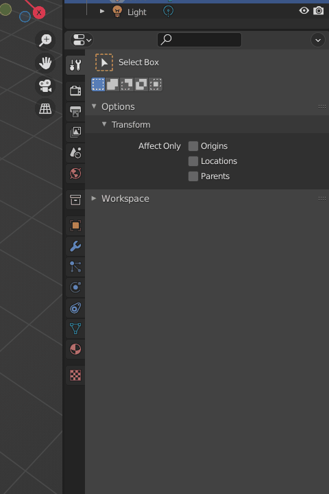

# Quick Properties v0.1

A simple efficiency hack to speed up property navigation in the Properties panel.

### Hotkeys

* <kbd>Shift</kbd> <kbd>1</kbd> : Object Tab
* <kbd>Shift</kbd> <kbd>2</kbd> : Data Tab
* <kbd>Shift</kbd> <kbd>3</kbd> : Modifier Tab
* <kbd>Shift</kbd> <kbd>4</kbd> : Material Tab
* <kbd>Shift</kbd> <kbd>Tab</kbd> : Tool Tab

These are the basic hotkeys suited to my most common workflow. Feel free to change them at your liking. You can also use double-pressing for more space.

### Installation
[Download](https://github.com/karmaral/quick-properties/releases/) the .py file and install it like any other addon.
